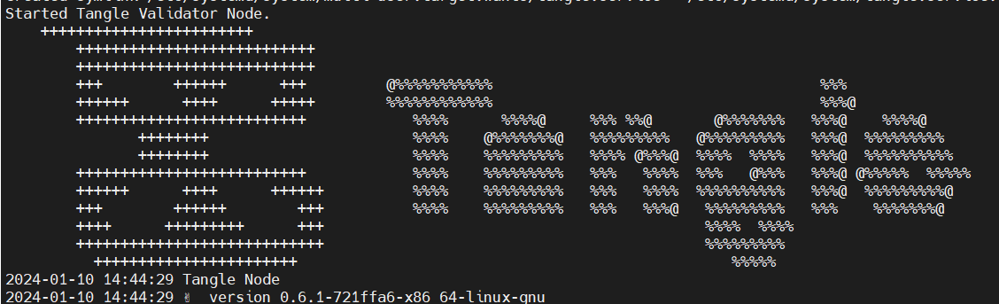
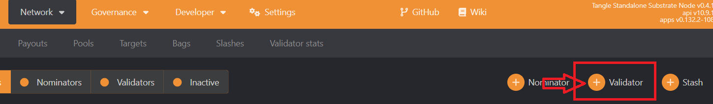
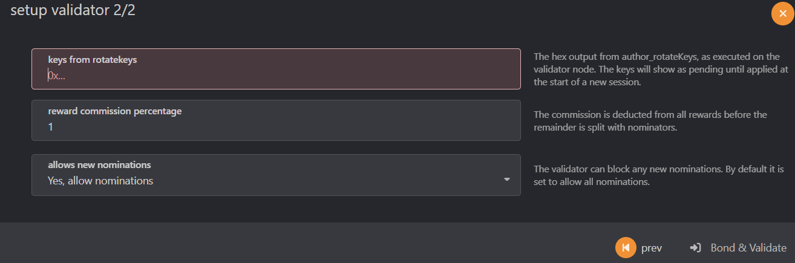

### **Tangle Validator Node Guide**

#### **Requirements**:
- **CPU**: Single Core
- **Memory**: 32 GB RAM
- **Disk**: 500 GB NVMe
- **Open Ports**: 30333, 30334 TCP

#### **Setup on Ubuntu Server (22.04)**:

1. **Update OS**: 
  ```bash
  sudo apt update && apt upgrade -y
  ```
2. **Install necessary utilities**: 
  ```bash
  sudo apt install curl iptables build-essential git wget jq make gcc nano tmux htop nvme-cli pkg-config libssl-dev libleveldb-dev libgmp3-dev tar clang bsdmainutils ncdu unzip llvm libudev-dev make protobuf-compiler -y
  ```
3. **Download the binary file**
  ```bash
  mkdir -p $HOME/.tangle && cd $HOME/.tangle
  wget -O tangle https://github.com/webb-tools/tangle/releases/download/v0.6.1/tangle-testnet-linux-amd64
  chmod 744 tangle
  mv tangle /usr/bin/
  # Check version
  tangle --version
  ```
4. **Setup tangle service with systemd**
  ```bash
  #export name node
  export tangleNodeName=<name>
  #config service
  tee /etc/systemd/system/tangle.service > /dev/null << EOF
[Unit]
Description=Tangle Validator Node
After=network-online.target
StartLimitIntervalSec=0
[Service]
User=$USER
Restart=always
RestartSec=3
LimitNOFILE=65535
ExecStart=/usr/bin/tangle \
  --base-path $HOME/.tangle/data/ \
  --name '$tangleNodeName' \
  --chain tangle-testnet \
  --node-key-file "$HOME/.tangle/node-key" \
  --port 30333 \
  --rpc-port 9933 \
  --prometheus-port 9615 \
  --auto-insert-keys \
  --validator \
  --telemetry-url "wss://telemetry.polkadot.io/submit 0" \
  --no-mdns
[Install]
WantedBy=multi-user.target
EOF
  ```
```bash
  systemctl daemon-reload
  systemctl enable tangle
  systemctl restart tangle && journalctl -u tangle -f -o cat
```


Once the node has synchronized, we remove the lock from the node by entering the command
  ```bash
  curl -H "Content-Type: application/json" -d '{"id":1, "jsonrpc":"2.0", "method": "author_rotateKeys", "params":[]}' http://localhost:9933
  ```
  If you get the same result then everything is great {"jsonrpc:"2.0","result:"0xa0very0long0hex0string","id":1} - copy the key (in bold) we will need it in the future close hybrid

5. Setting identity on chain
- Visit this website [Polkadot](https://polkadot.js.org/apps/?rpc=wss%253A%252F%252Ftestnet-rpc.tangle.tools#/settings) and create a wallet first
- For the stash, we configure Set Identity on Chain for identification
- To do this, select <b>Network</b> > <b>Staking</b> > <b>Account</b> > <b>Validator</b>



Next, insert our key received from the validation button, choose the commission percentage


As soon as you get a place among the validators, you will appear in the <b>Staking Overview</b> tab, but for now you can find yourself on the <b>Waiting</b> tab

### Check Logs
```bash
journalctl -u tangle -f -o cat
```
